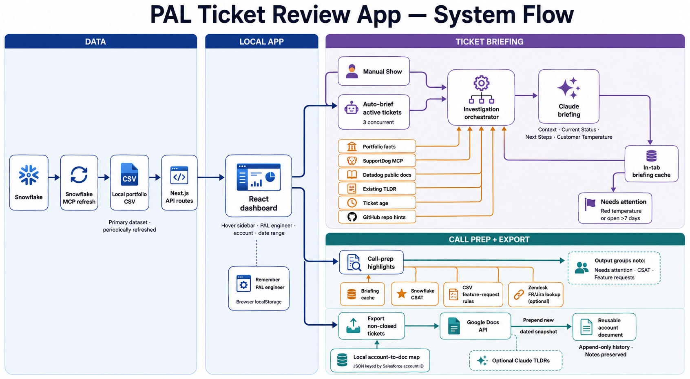
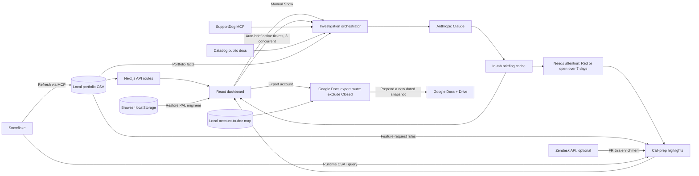

# How the PAL Ticket Review App works

The PAL Ticket Review App is a local call-preparation dashboard for Premier Support (PAL) engineers. It answers three practical questions:

1. Which accounts and tickets belong to each PAL engineer?
2. Which tickets deserve attention before a customer call?
3. What is the short, evidence-based story for an individual ticket?

It also exports an account's current ticket list to a reusable Google Doc.

The app is built with Next.js 15 and React 19 and runs locally on port **5103**. The browser provides the interface, while server-side Next.js routes keep credentials private and perform filesystem, MCP, Anthropic, Zendesk, and Google API work.

## The architecture at a glance



For a box-by-box explanation written for readers new to the project, see
[`docs/SYSTEM_FLOW_GUIDE.md`](./docs/SYSTEM_FLOW_GUIDE.md).



There is no application database. The portfolio CSV is the main dataset, browser state holds the current UI session, and a small JSON file remembers which Google Doc belongs to each account.

## 1. Starting the app

`npm run dev` starts the Next.js development server at `http://localhost:5103`. The application has two user-facing pages:

- `/` — the portfolio explorer and call-prep dashboard.
- `/tickets/[ticketId]` — a standalone ticket detail page that loads the export facts and automatically generates a briefing.

`app/page.js` renders `components/PalPortfolioExplorer.js`, which contains most of the main-screen behavior. Server work lives under `app/api/pal-portfolio/`.

## 2. How portfolio data reaches the screen

The core data flow is:

```text
Snowflake -> SQL query -> local CSV -> GET /api/pal-portfolio -> React state
```

### Loading existing data

On startup, the browser calls `GET /api/pal-portfolio`. The route uses `lib/palPortfolio.js` to find and parse a CSV. Unless `PAL_PORTFOLIO_CSV_PATH` is set, it looks for these names under `data/`, the project root, and the parent directory:

- `pal_engineer_accounts_tickets_last6mo.csv`
- `tmp_pal_engineer_accounts_tickets_last6mo.csv`

CSV headers are converted to camel case, so fields such as `PAL_LIAISON_EMAIL` and `TICKET_STATUS` become `palLiaisonEmail` and `ticketStatus` in JavaScript.

Each row represents a PAL engineer/account/ticket relationship. The exported fields include PAL identity, Salesforce account identity, Datadog and Zendesk organization details, and ticket routing metadata such as ID, subject, status, creation time, product, and impact.

### Refreshing from Snowflake

The **Refresh data** action first calls `POST /api/pal-portfolio/refresh-from-snowflake`. That route:

1. Reads `scripts/snowflake_pal_engineer_accounts_tickets_6mo.sql`.
2. Runs it through the Snowflake MCP client.
3. Converts the result to CSV in the expected column order.
4. Writes the new file atomically using a temporary file and rename.
5. Returns the new path, row count, and export time.
6. Lets the browser reload `GET /api/pal-portfolio`.

The default query window is six months. `PAL_PORTFOLIO_TICKET_MONTHS` can change it from 1 to 24 months.

Important: the dashboard reflects the Snowflake export time, not live Zendesk state. Refreshing makes the CSV newer, but the warehouse itself may still lag behind Zendesk.

## 3. How the main dashboard works

The browser derives the UI from the loaded rows; it does not make separate server requests for the engineer and account dropdowns.

The PAL engineer, account, date controls, Snowflake refresh, and SupportDog status are in a collapsed purple sidebar. Hovering or focusing the sidebar expands it. Before an account is selected, the main page shows a welcome explanation and empty status sections so the page structure remains visible.

1. It creates a unique engineer list from `palLiaisonEmail`.
2. Selecting an engineer filters the account list by that email and saves the selection in browser `localStorage`.
3. On a later visit, the saved engineer is restored if that email is still present in the current export. The account itself is not persisted.
4. Selecting an account filters rows by both the engineer email and `salesforceAccountId`.
5. Date controls and presets filter tickets by creation date.
6. `lib/palPortfolioTicketPrioritization.js` groups the remaining tickets by status and sorts open-like tickets by an attention score derived from priority, age, escalation, complexity, and other export signals.

Terminal tickets—solved, closed, or merged—are kept only when their solved or updated time falls in the trailing 30-day window ending on the selected **To** date. Closed tickets are hidden by default and can be revealed with the UI toggle.

Ticket links open Zendesk when a Zendesk agent base URL is configured. Otherwise, they open the app's own `/tickets/[ticketId]` page.

The selected account also gets a constructed link to its customer KPI dashboard in Metabase. This is only a URL; the app does not query Metabase.

## 4. Customer call-prep highlights

Call prep now uses the same account and created-date range as the main ticket table; there is no separate highlights date control.

When an account is selected, the browser automatically requests an investigation briefing for every non-terminal ticket. It runs up to three requests concurrently and shows progress while the briefings complete. Each returned briefing is parsed for its **Customer Temperature** section.

The visible highlight groups are:

- **Needs attention** — active tickets whose generated Customer Temperature is **Red**, or which have been open for more than seven days. Red tickets sort first, followed by the oldest tickets.
- **Bad CSAT ratings** — runtime Snowflake results, including satisfaction comments.
- **Good CSAT ratings** — runtime Snowflake results, including satisfaction comments.
- **Feature requests — open Datadog-side bugs** — feature requests with product-bug signals that are not terminal.
- **Feature requests** — all feature or enhancement requests in the current table range.

`lib/palPortfolioCallHighlights.js` still detects several CSV-based risk signals internally, but the current UI uses its feature-request collections rather than displaying the older engineering, export-sentiment, resolution, and long-running categories separately.

Two optional enrichments add information not reliably present in the portfolio CSV:

- **FR Jira links:** `POST /call-prep/resolve-fr-jira` inspects Zendesk ticket data when the export does not contain an `FR-####` key. The browser requests at most 24 unresolved ticket IDs at a time.
- **Good and bad CSAT:** `POST /call-prep/csat-ratings` runs targeted Snowflake queries for the selected organization and main table date range.

The repository still contains the live comment-sentiment endpoint, but the current dashboard no longer calls it. Zendesk credentials are therefore used by call prep for FR/Jira resolution; Snowflake MCP powers CSAT. Missing integrations do not prevent the rest of the portfolio from working.

## 5. How a ticket briefing is generated

`POST /api/pal-portfolio/ticket/[ticketId]/analyze` can now be triggered in three ways:

- Automatically for every active ticket after an account is selected, so the app can calculate **Needs attention**.
- By clicking **Show** in a highlight or status table.
- Automatically from the standalone ticket page after its export facts load.

The route first finds the ticket in the portfolio CSV. If the ticket is not in the export, it returns 404 even if the ticket exists in Zendesk, because the export defines the app's portfolio scope.

When an Anthropic API key is available, `lib/investigationPlaybookOrchestrator.js` assembles the prompt in this order:

1. **Portfolio facts** — subject, status, account, product, impact, and PAL routing fields from the CSV.
2. **SupportDog evidence** — it probes supported datacenters, fetches the Zendesk ticket and comment thread, and gathers organization context when available.
3. **Existing TLDR** — it searches internal comments for the latest note that looks like a TLDR. If no public customer reply followed it, it is marked current and used as the summary's foundation. Otherwise it is marked stale background.
4. **Ticket age** — calculated server-side from the creation timestamp.
5. **Public Datadog docs** — up to three relevant documentation pages are selected by topic and fetched as text excerpts.
6. **GitHub hints** — up to three likely Datadog repositories are named as diagnostic pointers. The app does not inspect repository code or create fixes.
7. **Claude synthesis** — Claude turns the assembled evidence into a short call-ready briefing.

The requested output has exactly four sections:

- **Context**
- **Current Status**
- **Next Steps**
- **Customer Temperature** — green, orange, or red, based mainly on customer language and secondarily on ticket age.

The browser stores generated briefings only in component state, shared by the call-prep and status-table views. Manual expansion reuses an automatically generated result instead of making a duplicate request. Changing PAL or account clears the cache, and reloading the page clears it. Because selection now briefs every active ticket, choosing a large account can make several Anthropic and SupportDog requests even if the user does not manually expand a briefing.

### Graceful degradation

| Available configuration | Result |
|---|---|
| No `ANTHROPIC_API_KEY` | A deterministic CSV-only Markdown briefing is returned. |
| Anthropic configured, SupportDog unavailable | Claude still runs with export facts, public docs, and repository hints. |
| Anthropic and SupportDog available | The briefing includes the real ticket conversation and organization context. |
| Anthropic request fails | The endpoint returns an analysis error; it does not silently invent a result. |

SupportDog uses per-datacenter OAuth sessions stored in sealed HTTP-only cookies. The **Connect all** flow walks through US1, US3, US5, EU1, AP1, and AP2. The UI periodically refreshes its status, but a token can still expire between checks; an analysis response therefore reports its actual SupportDog result and the UI displays a warning when evidence was unavailable.

## 6. Google Docs export

Once an account is selected, the app can export its tickets to a Google Doc using the signed-in user's Google account.

The flow is:

1. `GET /api/pal-portfolio/account-docs` reports whether Google OAuth is configured, whether the browser is signed in, and which account documents are already known.
2. The user signs in through the routes under `/api/pal-portfolio/google/oauth/`.
3. **Export to Google Doc** calls `POST /api/pal-portfolio/export-to-doc` with the Salesforce account ID and the TLDR option.
4. The server reloads all CSV rows for that Salesforce account, excludes tickets whose status is specifically **Closed**, and groups the remainder by status. This export does not use the browser's PAL or date filters.
5. If **Include TLDRs** is enabled, Claude creates a short `Issue:` / `Status:` summary for those non-closed tickets. Generation is capped at 25 tickets and runs four at a time.
6. `lib/googleDocExport.js` creates or updates the account document and adds links back to Zendesk.

The account-to-document mapping is stored in `data/pal_account_docs.json`, keyed by Salesforce account ID. The document and heading use the Zendesk organization name when available, then fall back to the Salesforce account name. On the first export, the app creates a document and grants link-view access to the `datadoghq.com` domain.

Every later export is append-only: the app prepends a new dated ticket snapshot above the existing dated sections, even if another export already occurred on the same day. It never deletes or replaces an earlier snapshot. The insertion point is kept below the document heading and **Notes** block, preserving both the free-form notes area and the complete export history.

This mapping is local to one checkout. Another teammate's local copy will not know about the document unless it has the same JSON mapping.

## 7. Configuration and trust boundaries

The main environment variables are:

| Variable | Purpose |
|---|---|
| `PAL_PORTFOLIO_CSV_PATH` | Optional explicit portfolio CSV location. |
| `PAL_PORTFOLIO_SNOWFLAKE_SQL_PATH` | Optional explicit refresh SQL location. |
| `PAL_PORTFOLIO_TICKET_MONTHS` | Snowflake export window; defaults to 6. |
| `SNOWFLAKE_ACCOUNT`, `SNOWFLAKE_USER`, `SNOWFLAKE_MCP_CONFIG_FILE` | Snowflake MCP refresh and runtime CSAT queries. |
| `ANTHROPIC_API_KEY`, `ANTHROPIC_MODEL` | Ticket briefings and optional export TLDRs. |
| `SUPPORTDOG_OAUTH_COOKIE_SECRET` | Seals per-user SupportDog OAuth state and sessions. |
| `ZENDESK_SUBDOMAIN`, `ZENDESK_EMAIL`, `ZENDESK_API_TOKEN` | Optional live Zendesk enrichments. |
| `GOOGLE_OAUTH_CLIENT_ID`, `GOOGLE_OAUTH_CLIENT_SECRET`, `GOOGLE_OAUTH_COOKIE_SECRET` | Per-user Google Docs and Drive access. |
| `PAL_ACCOUNT_DOCS_PATH` | Optional location for the local account-to-doc JSON map. |

Secrets remain in `.env.local` and should not be committed. SupportDog and Google OAuth credentials are represented in sealed browser cookies; external calls and filesystem writes happen only in server routes, not in browser code.

## 8. Source map for maintainers

| Area | Main files |
|---|---|
| Pages and interface | `app/page.js`, `components/PalPortfolioExplorer.js`, `app/tickets/[ticketId]/*` |
| CSV discovery and parsing | `lib/palPortfolio.js`, `lib/csv.js` |
| Snowflake refresh | `app/api/pal-portfolio/refresh-from-snowflake/route.js`, `lib/palPortfolioSnowflakeExport.js`, `lib/snowflakeMcpClient.js` |
| Ticket grouping and highlights | `lib/palPortfolioTicketPrioritization.js`, `lib/palPortfolioCallHighlights.js` |
| Briefing orchestration | `app/api/pal-portfolio/ticket/[ticketId]/analyze/route.js`, `lib/investigationPlaybookOrchestrator.js` |
| SupportDog | `lib/supportdogInvestigationContext.js`, `lib/supportdogMcpClient.js`, `lib/supportdogOAuthSession.js` |
| Claude prompts | `lib/investigationPlaybookPrompt.js`, `lib/claudeInvestigationPlaybook.js`, `lib/claudeShortTicketTldr.js` |
| Google export | `app/api/pal-portfolio/export-to-doc/route.js`, `lib/googleDocExport.js`, `lib/palAccountDocStore.js` |
| Detailed field lineage | `DATA_SOURCES.md` |

## In one sentence

The app turns a periodically refreshed Snowflake portfolio export into a local, filterable PAL dashboard, enriches selected tickets with live support evidence and AI-generated call briefings, and preserves account-level snapshots in Google Docs.
